# Google Calendar API Setup Guide

This guide walks you through setting up Google Calendar API access for the Pied Piper Customer Service Agent.

**Estimated Time:** 10-15 minutes

---

## Prerequisites

- A Google account (Gmail or Google Workspace)
- Access to [Google Cloud Console](https://console.cloud.google.com)

> 💡 **Tip:** If using a Google Workspace account, you may have additional options like "Internal" apps that skip verification warnings.

---

## Step 1: Create a New Google Cloud Project

1. Go to [console.cloud.google.com](https://console.cloud.google.com)

2. Click the **Select Project** on the top navigation bar (To the right of "Google Cloud")
   

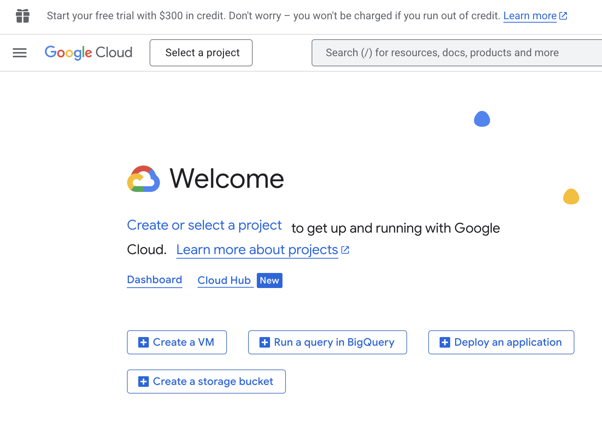

3. In the popup, click **New Project** (top right of the modal)

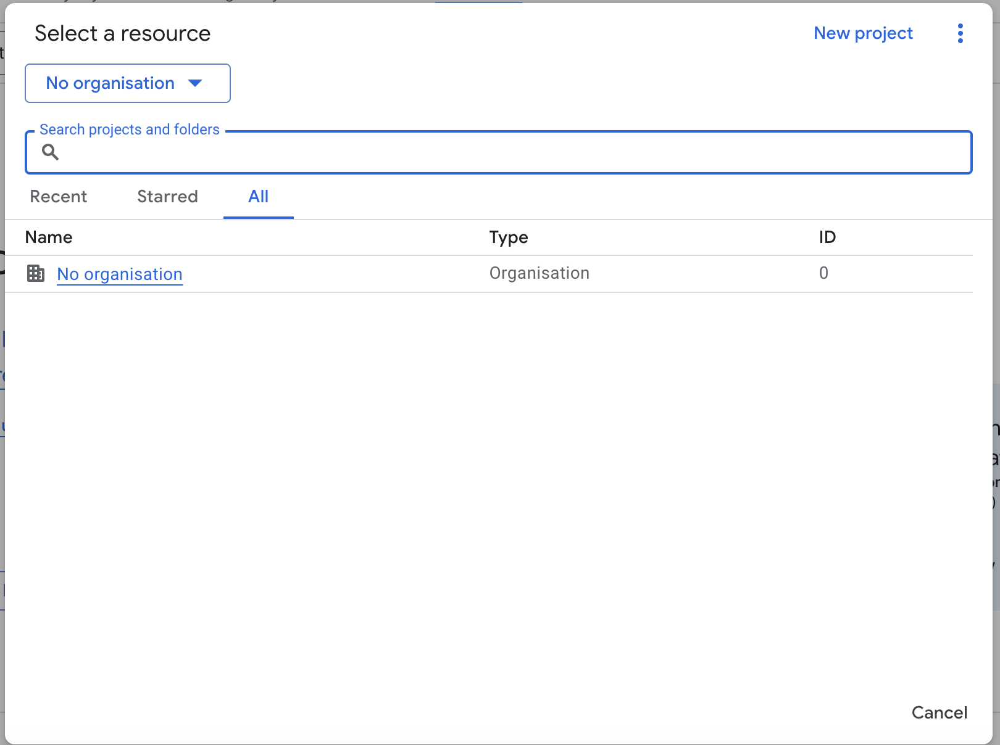

4. Fill in the project details: (You may name it your own)

If you're using a your own workspace account the form would look like this:
   - **Project name:** `pied-piper-customer-service`
   - **Organization:** Select your organization
   - **Location:** Select your org folder


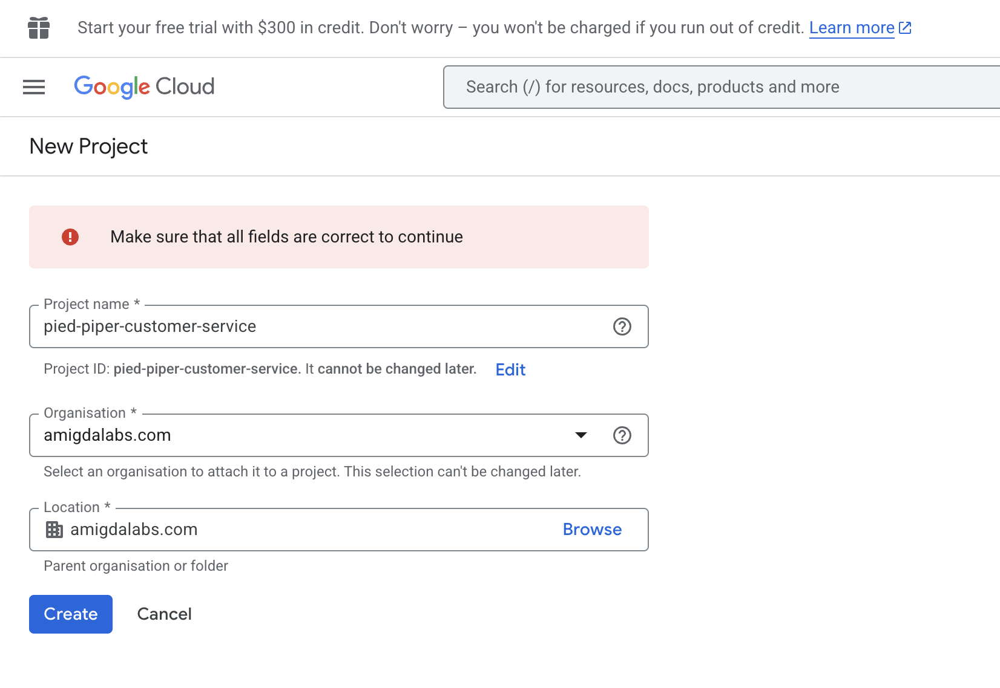

If you’re using a personal Google account, the screens you see may vary depending on your current setup. 

If you don’t yet have a billing account or organization, you can either:
- Set up a free trial, or
- Link a billing account directly to your project.

Google requires a billing account mainly to know where charges would go if you use paid services. For this use case, Google Calendar API is free, so you won’t be charged unless you enable or use other paid services (such as Cloud Databases, Compute Engine, or other billable resources).

If with billing account:
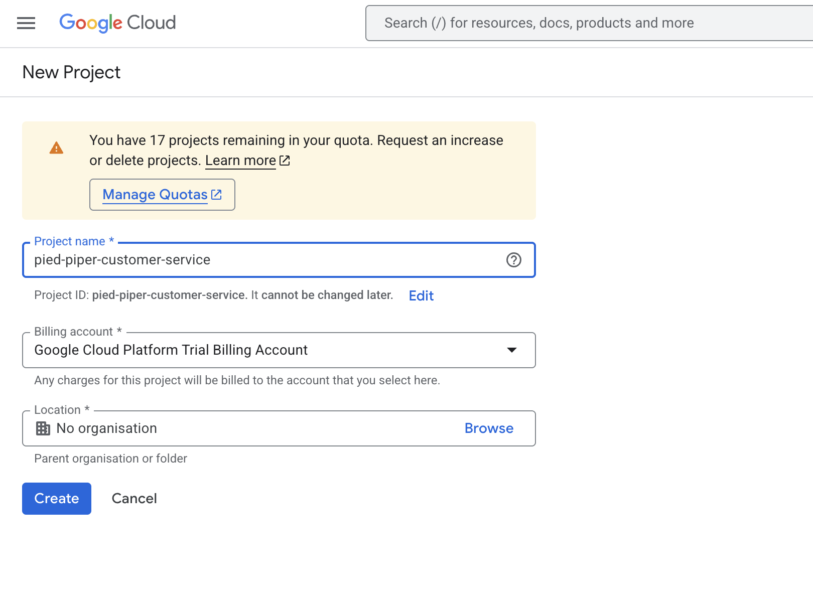

If without billing account:
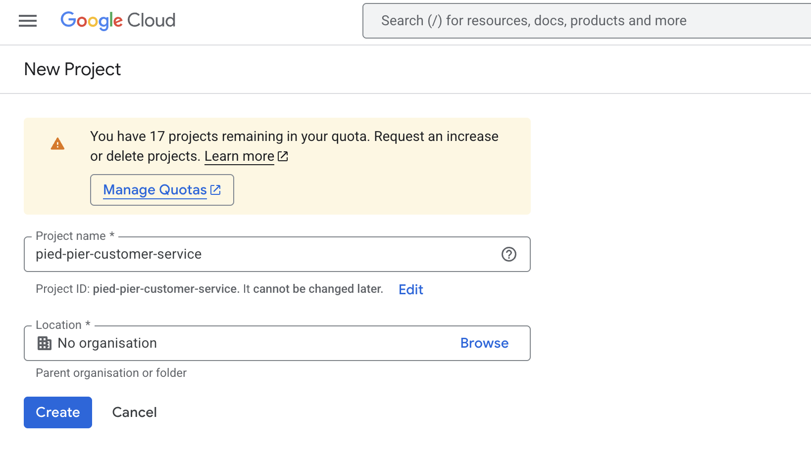

5. Click **Create**

6. Wait for the notification that your project is created (takes ~30 seconds)

7. **Important:** Make sure your new project is selected in the dropdown before continuing!

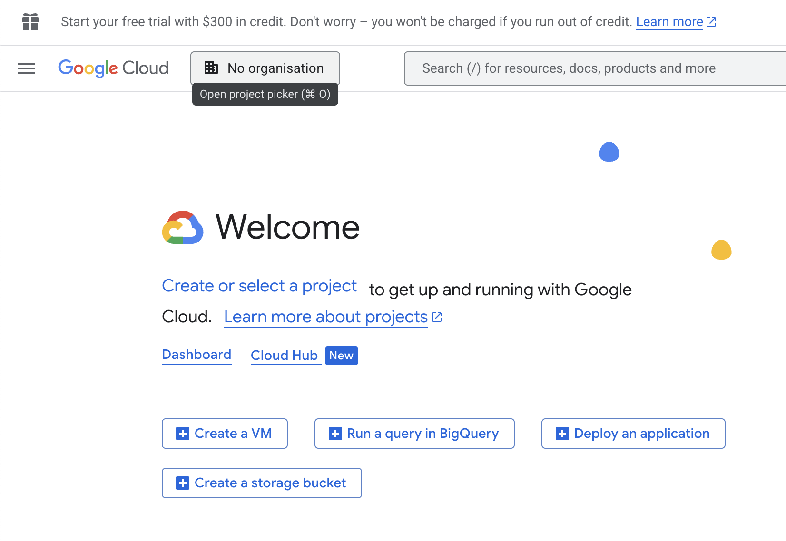
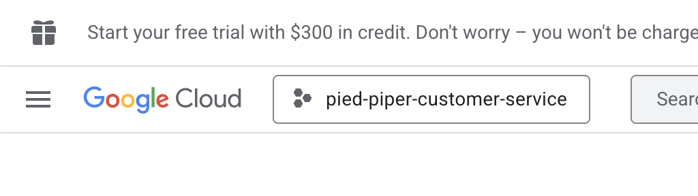

---

## Step 2: Enable the Google Calendar API

1. In the left sidebar, navigate to:
   ```
   APIs & Services → Library
   ```
   Or use the search bar at the top and search "API Library"

2. In the API Library, search for: `Google Calendar API`

3. Click on **Google Calendar API** in the results

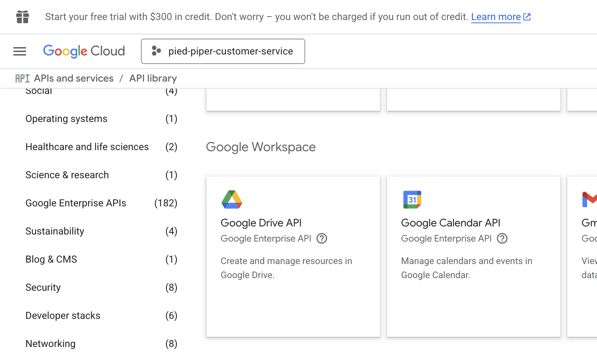

4. Click the **Enable** button

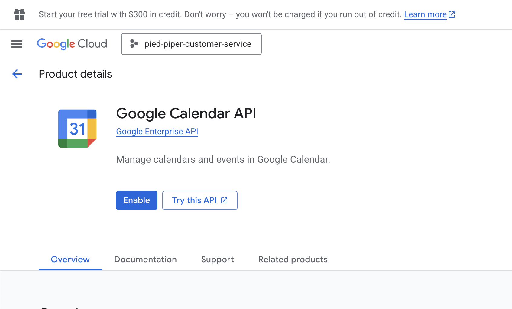

5. Wait for the API to be enabled (you'll be redirected to the API overview page)

> ✅ **Checkpoint:** You should see "API Enabled" status on the Google Calendar API page.

---

## Step 3: Configure the OAuth Consent Screen

Before creating credentials, you must configure how your app appears to users during authorization.

0. In the left sidebar, navigate to:
   ```
   APIs & Services → OAuth consent screen
   ```
   Click `Get started` if the Google auth platform is not configured yet. This will automatically send you to Create branding.

   Think of Branding as creating an official digital ID card for your **website or application**, in this case the python application is called Saas Customer Service. This setup is mandatory because Google needs to know exactly which app is requesting access to a private calendar before it will issue a "permanent key" (the token.json file) to your code. While your website/app visitors will never see this screen or need to log in to Google to book an appointment, you must use this "ID card" one time during setup to safely authorize the AI agent to manage your calendar on your behalf. Essentially, branding tells Google, "This specific agent is allowed to hold the keys to my house so it can let my guests in silently".

   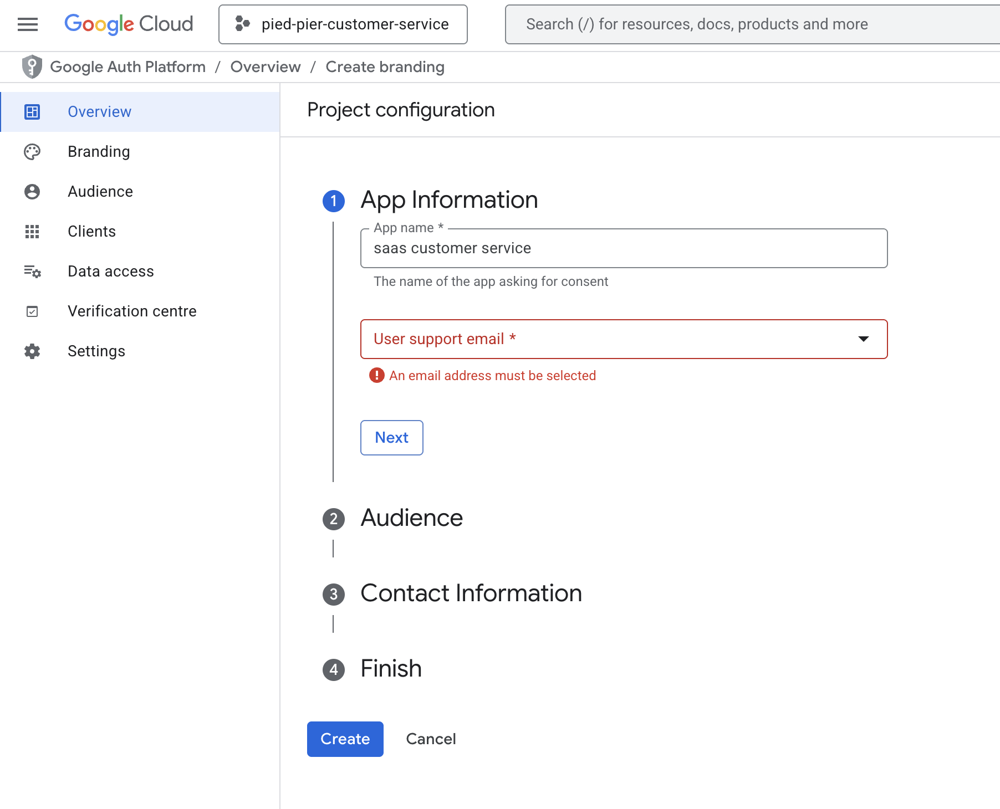
1. Fill out **App Information**:
   | Field | Value |
   |-------|-------|
   | App name | `saas customer service` |
   | User support email | Your email address |
   | App logo | (Optional - skip for now) |
2. Select **Audience**:

   Google auth platform not configured yet

   - **Internal** (Google Workspace only): Only users in your organization can use the app
   - **External**: Any Google user can use the app (requires verification for production) 
      - no complex organization setup
   
   > 📝 For this course demo, select **External** (unless you have Workspace and prefer Internal)

3. Click **Create**


5. Scroll down to **App domain** (all optional, skip for now)

6. Scroll to **Developer contact information**:
   - Add your email address

7. Click **Save and Continue**

---

## Step 4: Configure Scopes

Scopes define what permissions your app requests.

1. On the **Data Access** page, click **Add or Remove Scopes**

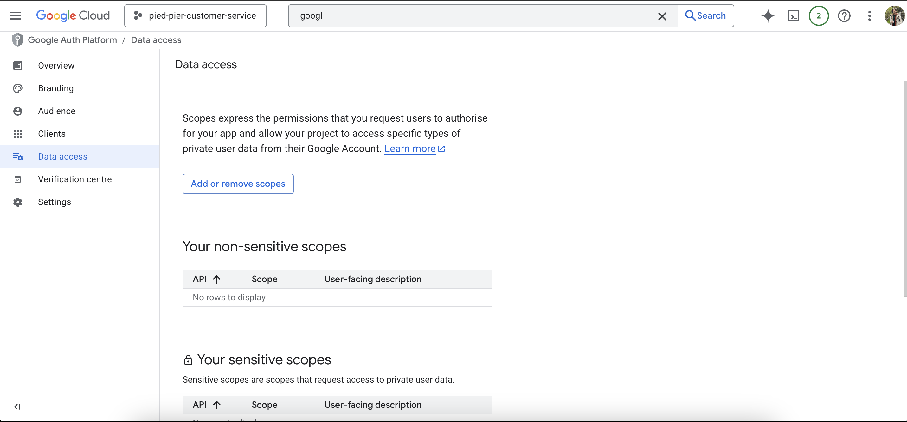

2. In the search/filter box, search for: `calendar`


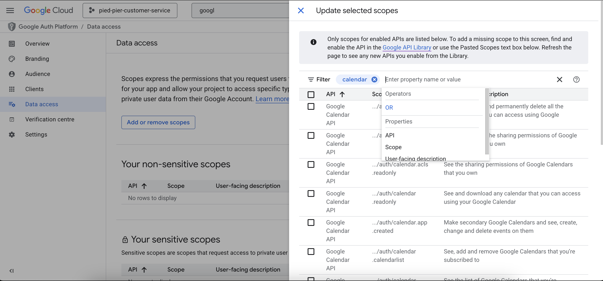

3. Find and check these scopes:
   
   | Scope | Description |
   |-------|-------------|
   | `.../auth/calendar.events` | View and edit events on all calendars |
   | `.../auth/calendar.readonly` | View calendars (optional, for read-only access) |

   > 🔒 For minimum permissions, just select `calendar.events`

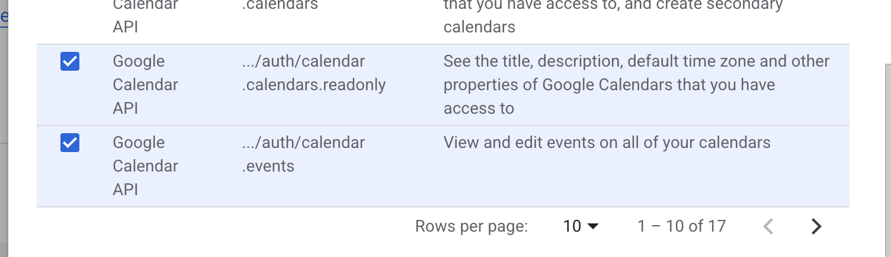

4. Click **Update** at the bottom of the panel

5. Click **Save and Continue**

---

## Step 5: Add Test Users (External Apps Only)

If you selected "External" user type, your app is in "Testing" mode by default.

1. On the **Audience** page, under **Test Users**, click **Add Users**

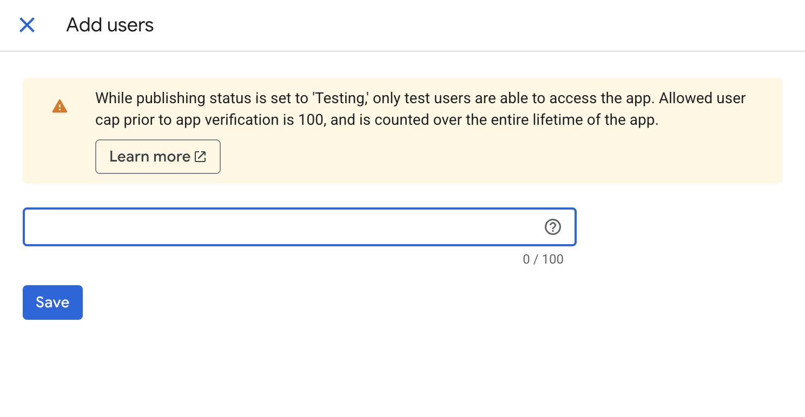

2. Enter the email address(es) that will use this app during development:
   - Your own email
   - Any other emails you'll test with

3. Click **Add**

4. Click **Save and Continue**

> ⚠️ **Important:** Only test users can authorize with your app while it's in "Testing" mode. You can add up to 100 test users.

---

## Step 6: Review and Back to Dashboard

1. Review your settings on the **Audience** page

2. Your OAuth consent screen should show:
> - Publishing status: "Testing"
> - User type: "External" (or "Internal")

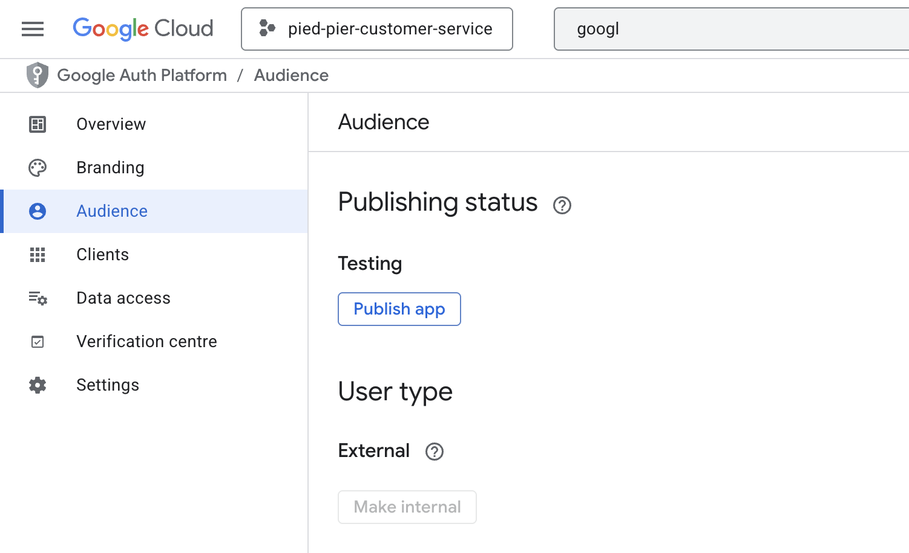


---

## Step 7: Create OAuth Client ID Credentials

Now we'll create the actual credentials your Python code will use.

1. In the left sidebar, navigate to:
   ```
   APIs & Services → Credentials
   ```

2. Click **+ Create Credentials** (top of page)

3. Select **OAuth client ID**

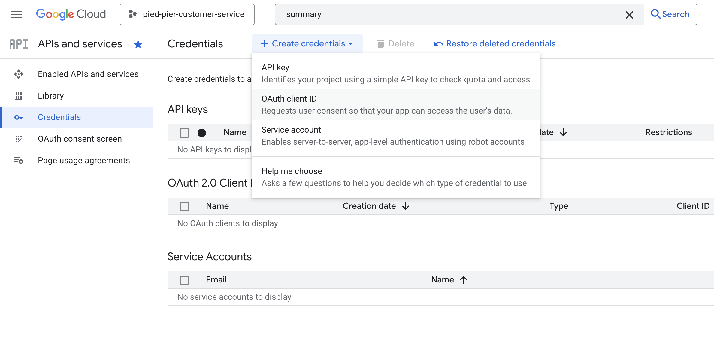

4. Configure the OAuth client:
   
   | Field | Value |
   |-------|-------|
   | Application type | **Desktop app** |
   | Name | `saas-customer-service` |

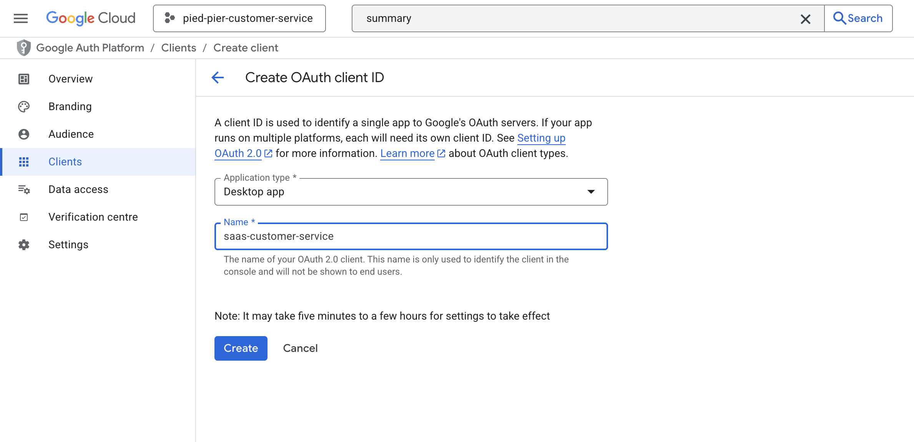

5. Click **Create**

6. A popup appears with your credentials. Click **Download JSON**

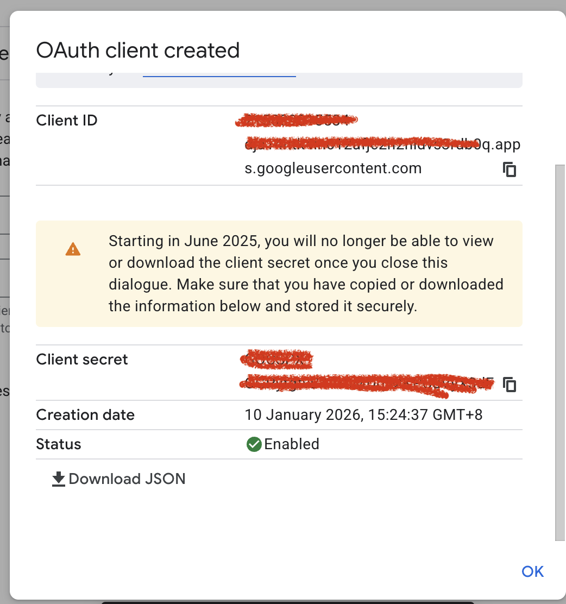

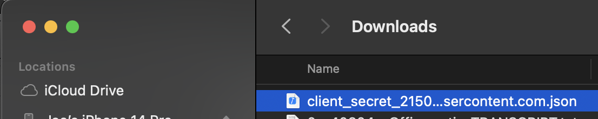

7. Click **OK** to close the popup

8. **Important:** Save this file as `credentials.json` in your project root directory

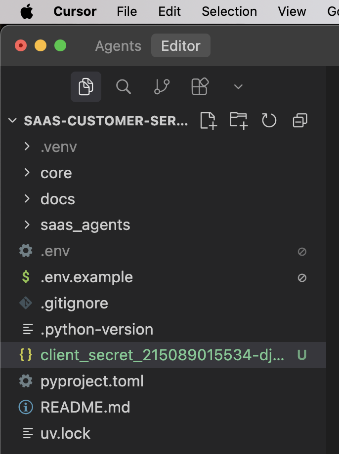


> 🔐 **Security Note:** Never commit `credentials.json` to version control! Add it to your `.gitignore`.

---

## Step 8: Update .gitignore

Add these lines to your `.gitignore` file to protect sensitive files:

```gitignore
# Google OAuth credentials
credentials.json
token.json
client_secret*.json
google_client_secret*.json
```

---

## Step 9: Install Required Python Packages

Add these dependencies to your project:

```bash
uv add google-api-python-client google-auth-httplib2 google-auth-oauthlib
```

Or if using pip:

```bash
pip install google-api-python-client google-auth-httplib2 google-auth-oauthlib
```

---

## Step 10: First-Time Authorization

The first time you run your app, you'll need to authorize it to access your calendar.

Create a test file `test_calendar_auth.py`:

```python
import os
from google.auth.transport.requests import Request
from google.oauth2.credentials import Credentials
from google_auth_oauthlib.flow import InstalledAppFlow
from googleapiclient.discovery import build

# If modifying scopes, delete token.json
SCOPES = ['https://www.googleapis.com/auth/calendar.events']

def get_calendar_service():
    """Create and return an authorized Calendar API service."""
    creds = None
    
    # Check if token.json exists (previous authorization)
    if os.path.exists('token.json'):
        creds = Credentials.from_authorized_user_file('token.json', SCOPES)
    
    # If no valid credentials, start OAuth flow
    if not creds or not creds.valid:
        if creds and creds.expired and creds.refresh_token:
            creds.refresh(Request())
        else:
            flow = InstalledAppFlow.from_client_secrets_file(
                'credentials.json', SCOPES
            )
            creds = flow.run_local_server(port=0)
        
        # Save credentials for next run
        with open('token.json', 'w') as token:
            token.write(creds.to_json())
    
    # Build and return the service
    service = build('calendar', 'v3', credentials=creds)
    return service

if __name__ == '__main__':
    print("🔐 Starting authorization flow...")
    service = get_calendar_service()
    
    # Test: List next 5 events
    print("\n📅 Testing Calendar API - Fetching upcoming events...")
    events_result = service.events().list(
        calendarId='primary',
        maxResults=5,
        singleEvents=True,
        orderBy='startTime',
        timeMin='2024-01-01T00:00:00Z'
    ).execute()
    
    events = events_result.get('items', [])
    
    if not events:
        print('No upcoming events found.')
    else:
        print(f'Found {len(events)} events:')
        for event in events:
            start = event['start'].get('dateTime', event['start'].get('date'))
            print(f"  - {start}: {event['summary']}")
    
    print("\n✅ Authorization successful! token.json has been created.")
```

Run the test:

```bash
python test_calendar_auth.py
```

**What happens:**
1. A browser window opens asking you to sign in to Google
2. You'll see a warning "Google hasn't verified this app" - click **Continue**
3. Grant the requested calendar permissions
4. The browser shows "The authentication flow has completed"
5. Return to your terminal - you should see your calendar events listed
6. A `token.json` file is created (stores your access/refresh tokens)

---

## Troubleshooting

### "Access blocked: This app's request is invalid"
- Make sure you downloaded the correct `credentials.json` file
- Verify the file is in your project root directory

### "Error 403: access_denied"
- Make sure your email is added as a test user (Step 5)
- The test user email must match the Google account you're signing in with

### "The OAuth client was not found"
- Re-download `credentials.json` from Google Cloud Console
- Make sure you're using the correct project

### Browser doesn't open automatically
- Check the terminal output for a URL
- Copy and paste it into your browser manually

### Token refresh errors
- Delete `token.json` and re-run the authorization flow
- Make sure your OAuth consent screen is still configured

---

## Next Steps

Once authorization is working, you're ready to integrate Google Calendar into your Front Desk Agent! See `README.md` for integration instructions.

---

## Quick Reference

| Item | Location |
|------|----------|
| Google Cloud Console | [console.cloud.google.com](https://console.cloud.google.com) |
| API Library | APIs & Services → Library |
| OAuth Consent | APIs & Services → OAuth consent screen |
| Credentials | APIs & Services → Credentials |
| Calendar API Docs | [developers.google.com/calendar](https://developers.google.com/calendar/api/quickstart/python) |

